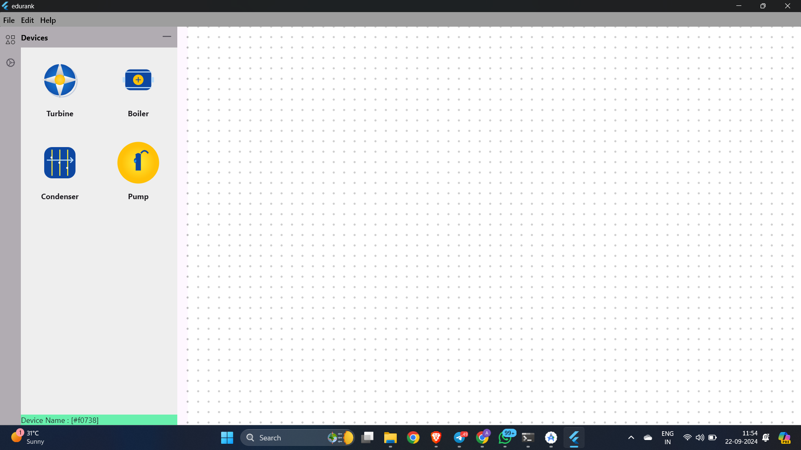
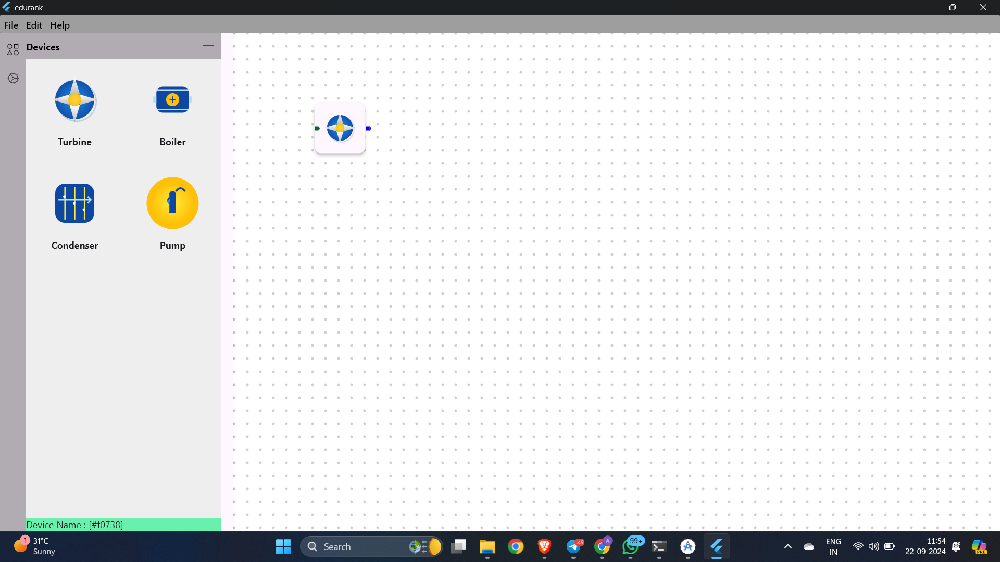
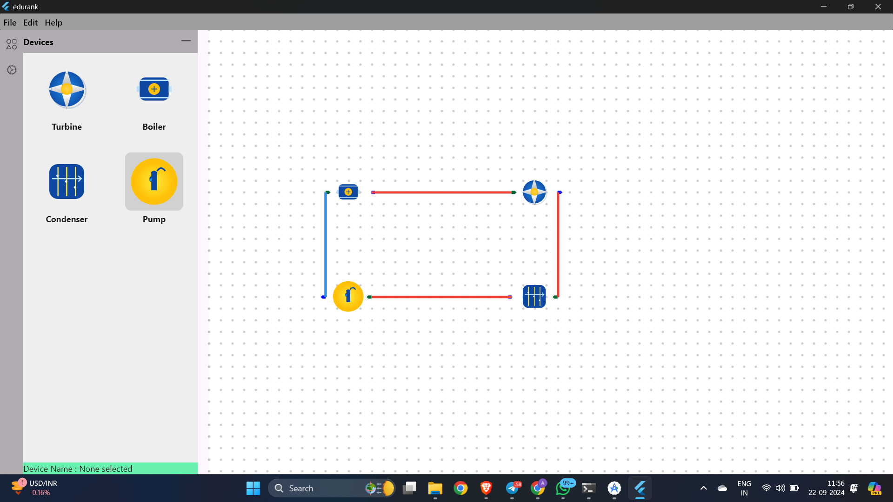
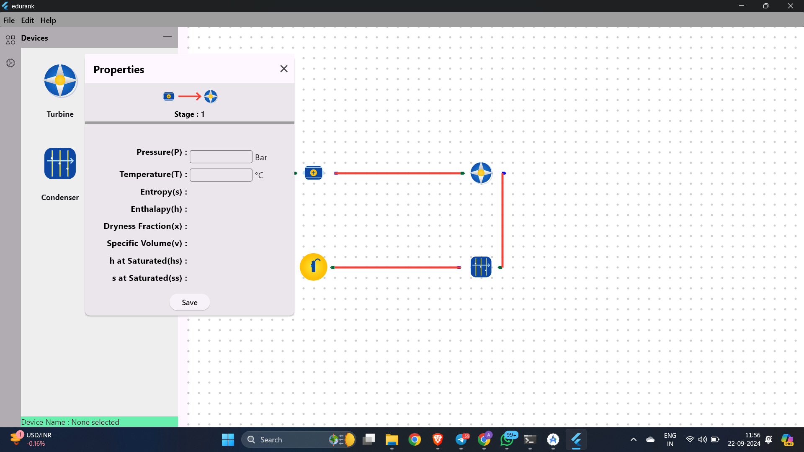
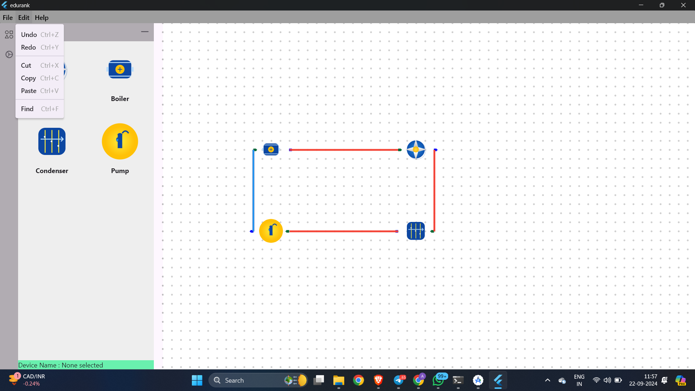
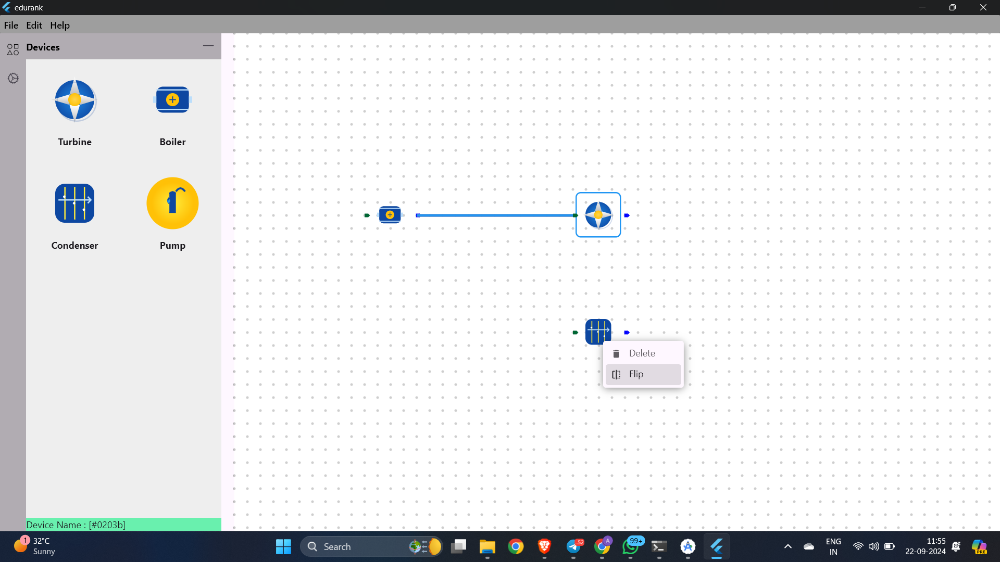
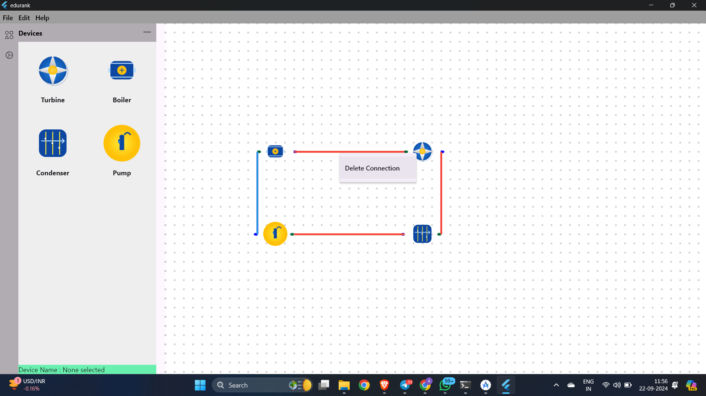
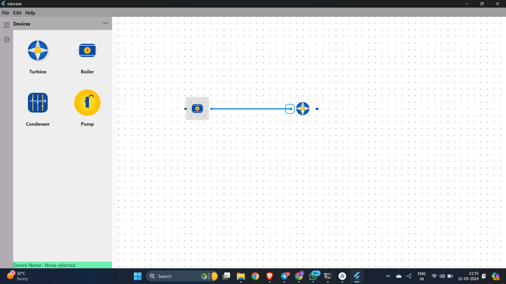
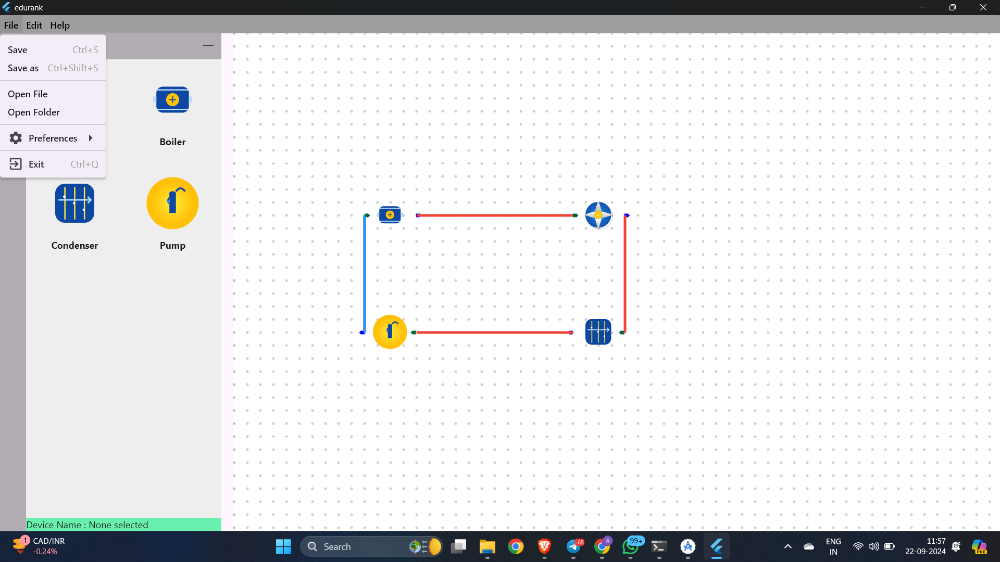
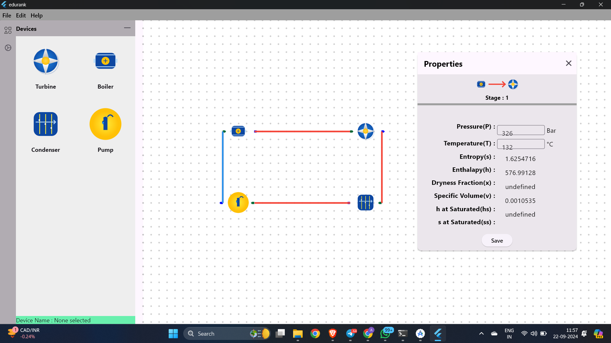

# ThermoCore

## Description

**ThermoCore** is a cutting-edge Windows application built using Flutter, designed to enable intuitive modeling and simulation of complex thermodynamic cycles. Targeted at engineers, researchers, and educators, ThermoCore provides a powerful tool for visualizing and analyzing energy systems with a focus on the Rankine cycle.

## Features

- **Interactive Design:** User-friendly drag and drop interface to arrange and connect components such as turbines, boilers, condensers, and pumps.
- **Simulation Capabilities:** Perform dynamic simulations with updates on thermodynamic properties like pressure and temperature in real time.
- **Customizable Parameters:** Allows users to set specific parameters for each component to tailor simulations to particular requirements.
- **Graphical Outputs:** Offers graphical representations of thermodynamic cycles, enhancing understanding of system behaviors under various operational conditions.

## Getting Started

### Prerequisites

Before installation, ensure your system meets the following requirements:
- Windows 10/11
- Flutter SDK (version >=3.2.6)
- Dart SDK (compatible with the Flutter SDK version)
- Git (for version control and cloning the repository)

### Installation

1. **Clone the Repository**
   Clone ThermoCore from GitHub to your local machine:
   ```bash
   git clone https://github.com/TheScriptRailoth/thermo-core.git
   cd thermo-core

2. **Install Dependencies Install the necessary Flutter packages:**

    ```bash
    flutter pub get
   
3. **Run the Application Launch the application on a Windows environment:**

    ```bash
    flutter run -d windows

### Screenshots

Explore some snapshots of ThermoCore in action, demonstrating its various capabilities and the user interface:

| Feature                   | Screenshot                                                |
|---------------------------|-----------------------------------------------------------|
| **Main Interface**        |      |
| **Component Placement**   |      |
| **Cycle Completion**      |    |
| **Properties Panel**      |    |
| **Editing Menu**          |                |
| **Context Menu**          |         |
| **Deleting Connection**   |  |
| **Joining Components**    |         |
| **Menu Bar**              |                  |
| **Property Editing**      |     |


### Contribution
Contributions are what make the open-source community such a fantastic place to learn, inspire, and create. Any contributions you make are greatly appreciated.

1. Fork the Project
2. Create your Feature Branch (git checkout -b feature/AmazingFeature)
3. Commit your Changes (git commit -m 'Add some AmazingFeature')
4. Push to the Branch (git push origin feature/AmazingFeature)
5. Open a Pull Request


### Contact
Your Name - Ashutosh Mishra - am3718440@gmail.com

Project Link: https://github.com/TheScriptRailoth/thermo-core